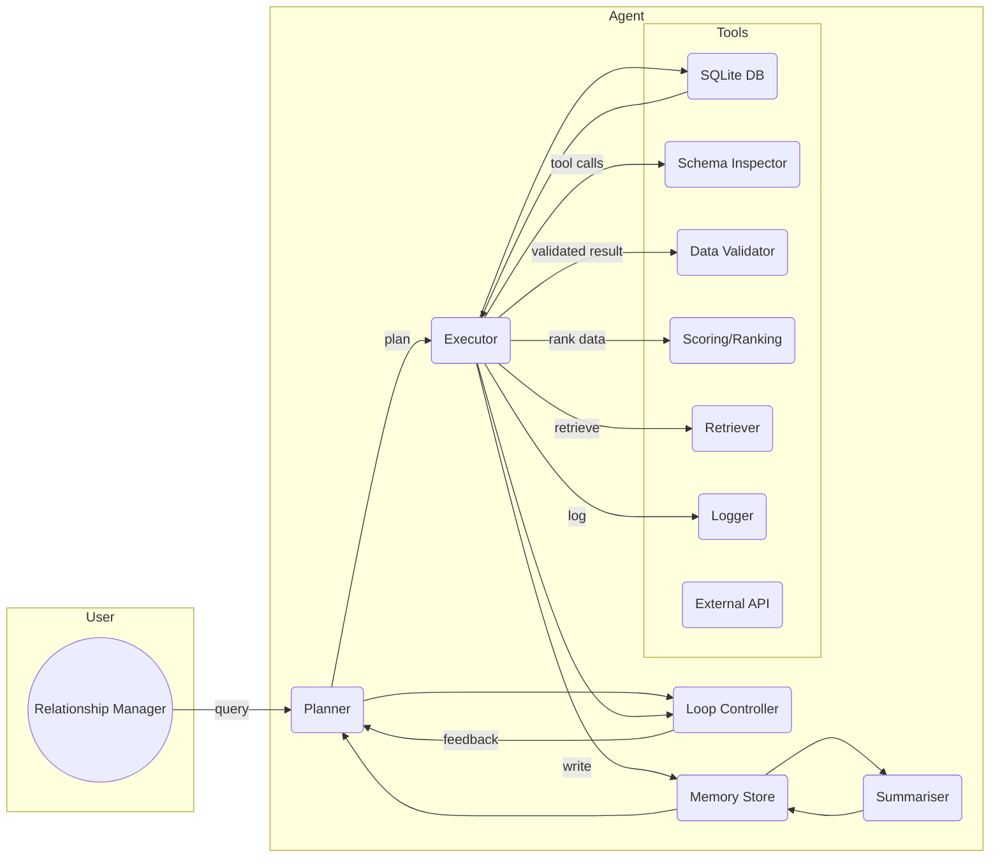

# Executive Summary

We propose an **agentic planner–executor architecture** that uses chain-of-thought reasoning with explicit memory and tool use to identify potential loan customers from a local SQLite database.  The agent decomposes the RM’s request into sub-tasks (via a *Planner*), executes each sub-task with specialized *Tools* (via an *Executor*), and maintains a **Memory store** of intermediate results and context.  A *Summariser* periodically compacts memory to prevent context overload, and a **Loop Controller** manages iterative plan revision.  We enforce *safety and interpretability constraints* by requiring the agent to externalize its chain-of-thought in language (for monitoring and validation【4†L28-L37】) and using parameterized, read-only database queries to prevent injection attacks【17†L268-L273】.  The design includes robust logging/provenance of all decisions and tool calls【26†L1026-L1034】, and metrics covering both task accuracy and resource use (e.g. result quality and latency)【29†L85-L93】【29†L75-L84】.  Prompt templates for the Planner and Executor (with examples) are provided, along with suggested memory schema and summarisation algorithms.  SQL templates assume typical banking tables (customers, loans, transactions) and select “potential borrowers” by credit score, income and transaction patterns.  We outline transaction and concurrency handling in SQLite (e.g. using **WAL mode** for concurrency【15†L179-L187】) and privacy measures (e.g. encryption-at-rest via SQLite SEE【34†L14-L22】, OS file-permission controls).  Finally, we describe testing/validation (unit, integration, memory-regression tests【26†L1048-L1056】, metrics) and illustrate the end-to-end process with an example run.

## System Architecture and Data Flow



**Figure:** *Agent Architecture.* The RM’s request is sent to the **Planner**. The Planner produces a structured plan (step-by-step tasks). The **Executor** then performs each step by calling appropriate *Tools*, such as the SQLite query tool, schema inspector, etc. Results of each step are added to **Memory**. The **Summariser** periodically compresses old memory entries into concise records. The **Loop Controller** uses execution feedback and memory to decide if the plan needs revision, triggering the Planner again. The **Logger** tool records all actions for provenance.

## Planner–Executor Loop and Chain-of-Thought Prompting

We adopt a **planner–executor loop** akin to ReACT or recent memory-based agent frameworks【1†L181-L190】【10†L19-L27】. The Planner (an LLM prompt) emits a high-level plan (e.g. a numbered list of subtasks). The Executor then carries out the first subtask, emits an intermediate result, and updates memory. If intermediate results suggest the plan should change (e.g. missing data, unexpected output), the Loop Controller triggers a **replan**. Otherwise, the Executor proceeds. This loop continues until all subtasks are complete or no further actions are needed.

- **Chain-of-Thought Prompting:** Each Planner prompt follows a chain-of-thought (CoT) style, explicitly detailing reasoning steps. This improves transparency and performance【1†L181-L190】. We use few-shot templates with examples of how to decompose queries into subtasks. For interpretability, all intermediate reasoning (the “chain”) is output in natural language, enabling human or automated monitoring【4†L28-L37】.

- **Safety & Interpretability Constraints:** By externalizing reasoning as text, we gain “monitorability” for safety【4†L28-L37】. We constrain the agent to factual planning steps (no unsupported assumptions) and use explicit safety checks (e.g. verifying queries before execution). Chain-of-thought also allows auditors to review each step. However, CoT is fragile – LLMs can sometimes bypass or manipulate it【28†L7-L10】 – so we treat CoT as one layer among others (validation tools, logging, human oversight).

- **Decision-Update Logic:** After each Executor step, the agent considers: *Did this step succeed? Are the results as expected?* If not (e.g. query returned empty or unexpected data), the Loop Controller asks the Planner to revise the plan. Similarly, after a subset of tasks, we may run a review step (few-shot or learned) to check if additional subtasks are needed. This dynamic replanning (reflection) is inspired by research showing agents can self-correct【8†L190-L198】【10†L25-L27】. As a rule, we allow at most one major replan per loop to prevent oscillation.

- **Failure Modes & Mitigation:** Common pitfalls include *hallucinated steps*, *infinite loops*, or *data overload*. We mitigate by:
  - Forcing all queries through formal tools (no direct natural-language DB calls) to avoid hallucination of data.
  - Limiting iteration counts and checking for progress (if a plan doesn’t change outputs after several steps, abort).
  - Logging every step for post-hoc analysis【26†L1026-L1034】, enabling detection of loops or errors.
  - Periodically summarizing memory to avoid context overflow (see below).

## Tools and Interfaces

We define the following **tools**. Each tool is invoked by the Executor (via the LLM tools framework) and has a clear API:

| Tool               | Purpose                                                         | Input                                         | Output                                    |
|--------------------|-----------------------------------------------------------------|-----------------------------------------------|-------------------------------------------|
| **SQLite Query**   | Run parameterized SELECT/UPDATE/INSERT/DELETE on local DB       | SQL string with placeholders, parameters list | Query result rows (as JSON or records)    |
| **Schema Inspector**| Return schema info (tables, columns)                            | Table name (or `*` for all)                   | Table schemas (names, types, keys)        |
| **Data Validator** | Check returned data quality (e.g. missing fields, ranges)       | Query results                                 | Pass/fail or list of anomalies            |
| **Scoring/Ranking**| Compute likelihood of loan conversion for each candidate        | List of customer records                      | Scores or ranked list                     |
| **Retriever**      | Fetch relevant facts or past results from Memory                | Query (text or embedding)                     | Retrieved memory items                    |
| **Logger**         | Record each agent decision, query, response for provenance      | Event record (action, context)                | Write log entry                           |
| **External API** (opt.)| e.g. messaging, credit bureau lookup                       | API-specific parameters                       | API result (e.g. sentiment, credit score) |

These tools must be **well-specified**.  For example, the SQLite Query tool accepts SQL with placeholders `?` or `:param`【17†L268-L273】.  The tool should only permit read-only queries unless explicitly needed, and use transactions for any write. Each call is logged (tool name, query, parameters, timestamp, result summary).

A tabular summary of responsibilities is provided below. In brief, the **Planner** knows about the task goal and memory; the **Executor** carries out concrete operations and updates memory.

| Component      | Responsibilities                                           |
|----------------|------------------------------------------------------------|
| **Planner**    | - Interpret RM’s request; break into subtasks<br>- Prioritize steps<br>- Use memory context to adjust plan (e.g. incorporate past findings)<br>- Generate prompts for each subtask (e.g. “Run SQL to find customers…”). |
| **Executor**   | - Take one planned step; call tools with required parameters<br>- Validate tool outputs; if invalid, signal error<br>- Write results into Memory<br>- Possibly ask Planner for clarification if ambiguous (via Loop Controller). |
| **Memory**     | - Store past queries, results, partial plans, and user info<br>- Provide context to Planner (recent plan/results) and Executor (past queries)<br>- Summariser compacts this store to key info (see below). |
| **Summariser** | - Periodically compress older Memory into concise entries (e.g. “Customers X,Y identified with high score”)<br>- Ensure Memory stays within token limits and emphasizes important facts. |
| **Loop Controller** | - Monitor execution progress<br>- Decide when to trigger plan revision or termination<br>- Enforce safety limits (max iterations, forbid disallowed actions). |

## Memory Schema and Summarisation

We propose a **structured memory store** with fields such as:

| Memory Type       | Example Fields                                  |
|-------------------|-------------------------------------------------|
| **User/Context**  | RM query text; conversation history; user ID    |
| **Plan**          | Initial plan steps (list); any revised plans    |
| **Tool Logs**     | (tool, input, output) tuples for each step      |
| **Candidates**    | Partial results (customer IDs, metrics)         |
| **Insights**      | Domain facts or rules derived (e.g. “Customers >30yo more likely”) |
| **Failures**      | Failed queries or errors encountered            |

Memory entries include a timestamp and semantic tags (e.g. “SQLResults”, “PlanStep”). This enables the **Retriever** tool to fetch relevant past entries (via embedding or keyword matching) when reasoning about new tasks.

**Summarisation algorithm:** We use an LLM-based or heuristic summary of the memory when it grows too large【31†L478-L487】. For instance, after every N steps or at session end, the agent can prompt: “Summarise the key outcomes so far.” The summariser might output: “*Found 2 customers (IDs 101, 103) with credit score ≥650 and no active loan; maximum deposit last 6m was $5000.*” This summary is added to memory and older raw logs may be archived or pruned. We must watch for **summarization drift**: iteratively compressing memory can lose rare but important details【31†L478-L487】. To mitigate this, we mix summarisation with periodic retention of raw logs for critical steps (via the external store pattern【31†L494-L498】). Memory summarisation is akin to “rolling summaries” from literature【31†L478-L487】, and we may also keep a sliding window of raw context for the most recent turns.

Additionally, we employ retrieval-augmented memory: the Retriever uses semantic search (vector similarity) to find relevant past actions when planning new steps, similar to RAG agents【31†L511-L518】【31†L539-L547】.

## Prompts: Planner and Executor

We craft **prompt templates** to guide each module. For clarity, we show simplified examples.

- **Planner Prompt Template:**  
  *Context:* System instructions, current task, and relevant memory.  
  *Few-shot examples:* Prior examples of similar tasks split into steps.  
  *Goal:* Output a numbered plan of steps (bullets or JSON).

  **Example:**  
  ```
  You are an AI assistant planning tasks to find potential loan consumers. The RM’s request: "Find customers likely to convert for a personal loan this month." 
  Memory: Customer data tables with fields (id, age, credit_score, has_active_loan, monthly_deposits, ...). 
  Example Plan 1:
  1. Inspect database schema to identify relevant tables/fields.
  2. Query customers with no active loan and credit_score >= 650.
  3. Of those, filter by recent deposit behavior.
  4. Rank remaining customers by a scoring function.
  5. Output candidate list.

  Now produce a similar plan (1-5) for the current request.
  ```
  The Planner would return something like:
  ```
  1. Use Schema Inspector to list tables; identify fields: customers(id,credit_score,active_loan), transactions(amount,date).
  2. Query for customers with credit_score > ? AND active_loan = 0.
  3. Query for their recent deposits (last 6 months).
  4. Compute conversion_score for each (e.g. balance * credit factor).
  5. Return top-N candidates.
  ```

- **Executor Prompt Template:**  
  *Context:* One plan step, plus memory context (as needed).  
  *Goal:* Perform the step, e.g. generate an SQL query or call a tool, then output the result in structured form.  

  **Example (Step 2):**  
  ```
  Step: "Query for customers with credit_score > 650 AND no active loan." 
  Database schema indicates 'customers' table with fields (id, name, credit_score, active_loan_flag). 
  Generate the SQL and expected output format.
  ```
  The Executor might respond:
  ```
  SQL: SELECT id, name, credit_score FROM customers 
       WHERE credit_score > ? AND active_loan_flag = 0;
  Parameters: [650]
  Result: JSON array of {id, name, credit_score} for matching customers.
  ```
  
Each Executor response also includes a brief *chain-of-thought reasoning* about the tool call (optional, for auditing) and the actual output. For instance:  
```
"Thinking: We use a parameterized query to avoid injection (see SQLite docs【17†L268-L273】). 
Executing query... 
Result: [{id:101, name:"Alice", credit_score: 720}, ...]"
```
This makes the reasoning explicit and aids debugging.

## SQL Query Patterns for “Potential Loan Consumers”

**Assumed schema:** We assume tables such as `customers(customer_id, name, age, income, credit_score, has_active_loan, email, phone)` and `transactions(txn_id, customer_id, amount, date, type)`, etc.  Required fields are credit score, loan status, and recent transaction data.  

Example **parameterized** queries (using `?` or named parameters):

- **Find eligible customers:**  
  ```sql
  SELECT c.customer_id, c.name, c.credit_score, SUM(t.amount) AS total_recent_deposits
  FROM customers AS c
  LEFT JOIN transactions AS t 
    ON c.customer_id = t.customer_id 
       AND t.type = 'deposit' 
       AND t.date >= date('now','-6 months')
  WHERE c.credit_score >= :min_score
    AND c.has_active_loan = 0
  GROUP BY c.customer_id
  HAVING total_recent_deposits >= :min_deposits;
  ```  
  *Required fields:* `credit_score`, `has_active_loan` (boolean), `transactions.amount`, `transactions.date`. This retrieves customers above a credit threshold who have made at least a minimum deposit in the last 6 months.

- **Identify customers with no recent payments:**  
  ```sql
  SELECT customer_id, name 
  FROM customers 
  WHERE last_loan_payment_date IS NULL 
    AND credit_score >= ?;
  ```  
  (Assuming a field `last_loan_payment_date` – adapt as needed.)  

- **High transaction volume:**  
  ```sql
  SELECT c.customer_id, c.name, COUNT(t.txn_id) AS txns_last_month
  FROM customers c JOIN transactions t 
    ON c.customer_id = t.customer_id
  WHERE t.date BETWEEN date('now','start of month') AND date('now')
  GROUP BY c.customer_id
  HAVING txns_last_month > ?;
  ```  

These templates can be adjusted per actual schema.  All queries use **parameter binding** to prevent injection【17†L268-L273】.  We would replace `?` or `:min_score` with runtime values. After fetching raw candidates, the Executor passes them to the **Scoring/Ranking** tool, which computes a conversion likelihood (e.g. weighted by credit score, deposit growth, etc.).  The final output is a ranked list of customer IDs with scores and contact info.

## Transaction, Concurrency and Security

- **Transactions:** All multi-step DB operations should be wrapped in SQLite transactions (BEGIN/COMMIT) to ensure consistency【20†L27-L35】. Even reads should ideally use `BEGIN IMMEDIATE` or `BEGIN EXCLUSIVE` if following by writes, though for our read-mostly use case, default DEFERRED reads are sufficient. SQLite provides **serializable isolation** by default【20†L27-L35】, so each transaction sees a consistent snapshot. For example, our SQL tool might automatically run `BEGIN TRANSACTION` before executing a batch of queries.

- **Concurrency:** By default, SQLite allows only one writer at a time, but many concurrent readers. Using **Write-Ahead Logging (WAL) mode** improves concurrency: readers do not block writers and vice versa【15†L179-L187】. We enable WAL (via `PRAGMA journal_mode=WAL`) so that the agent’s read queries don’t block the RM’s or other processes’ writes. Remember, even in WAL, only one process can write at a time【15†L179-L187】. Our agent should catch `SQLITE_BUSY` exceptions (when DB is locked) and retry after a short delay.

- **Security & Privacy:** We use **parameterized queries** (above) to prevent SQL injection【17†L268-L273】. Database access should run under an OS user with minimal privileges (file read/write only for that database) to follow the principle of least privilege. For sensitive data, use **SQLite Encryption Extension (SEE)** to encrypt the database at rest【34†L14-L22】, so even if the file is accessed, it appears as “white noise” to attackers. Any output (customer lists) should exclude or mask direct PII (emails, phone numbers) unless needed, and in transit ensure secure channels. Audit logging (see below) further helps detect any unauthorized data access. We explicitly *do not* execute any external code on the DB or allow raw user-supplied SQL beyond defined templates.

## Logging, Provenance and Monitoring

Every step is logged via the **Logger tool**. For transparency and debugging, we record: timestamp, which tool was invoked, inputs/queries, outputs (or a hash thereof), and the agent’s intermediate reasoning. As recommended, “every write, read, update, and delete should be recorded with timestamps, triggering context, and the records involved”【26†L1026-L1034】. We maintain a *provenance trace*: linking each output (e.g. final candidate list) to the exact sequence of queries and reasoning steps. This facilitates audits and rollback if needed. 

Additionally, we apply **memory operation logging** as per best practice: log each memory write/read for retrospective analysis【26†L1026-L1034】.  This also supports continuous improvement (e.g. noticing unused memory entries)【26†L1038-L1046】. 

## Performance Metrics

We evaluate the system on both **effectiveness** and **efficiency** metrics. Key metrics include:  
- **Task Success:** Did the agent find *correct* high-potential customers? Measured by precision/recall against a ground-truth set (if available) or business KPIs (e.g. conversion rates).  
- **Plan Completion Rate:** Fraction of plans fully executed without errors (as per【29†L75-L84】).  
- **Reasoning Accuracy:** Any fact-check metrics (e.g. whether all generated SQLs were syntactically valid and returned data).  
- **Latency:** Total runtime, including LLM calls and DB queries. Since LLM reasoning can be expensive, we measure token usage per step and end-to-end latency【29†L85-L93】.  
- **Resource Cost:** For deployment, track compute usage (GPUs/CPU) and memory (both DB and LLM context size). Efficiency gains (e.g. using recall vs longer context) are important【29†L85-L93】.  

We aim to report both accuracy and cost (tokens, time) jointly【29†L85-L93】. For example, if a more detailed plan yields only marginal improvement but doubles query count, we reconsider it.

## Testing and Validation

Our testing strategy covers:

- **Unit Tests:** For each tool interface. E.g. verifying the Schema Inspector returns correct columns for a mock schema; the SQLite tool returns expected rows for synthetic data; the Scoring tool correctly ranks given inputs.

- **Integration Tests:** Simulate full interactions with a sample SQLite DB containing known customer data. Feed in queries and check final outputs. Use a **fixture DB** with edge cases (e.g. no matching customers, duplicate entries, extreme values).

- **Memory/Regression Tests:** As recommended in agent memory surveys, we include regression tests for memory behavior【26†L1048-L1056】. For example, after an update to the agent, run a scripted session and assert that memory retrieval gives the same results as before. This guards against forgetting or altering learned defaults.

- **Safety Tests:** Ensure the agent never executes disallowed actions. We fuzz test the Planner prompt with malicious inputs to see if it tries unsafe operations. The Data Validator tool can be extended to check no personally identifying information leaks.

- **Performance Benchmarks:** Regularly measure response times and accuracy on a representative workload. Compare token counts and latency to ensure we meet SLAs.

## Example End-to-End Interaction

**User (RM):** “Identify customers likely to take a personal loan this month.”

**Planner (initial plan):**  
```
1. Use Schema Inspector to find tables; note 'customers' (id, credit_score, has_active_loan, age, income) and 'transactions'.
2. Query customers with credit_score >= 650 and active_loan = 0.
3. For those customers, sum deposits in last 6 months from 'transactions'.
4. Filter for those with deposits > 1000.
5. Rank remaining customers by (credit_score + total_deposits).
6. Output top candidates with their contact info.
```

**Executor (step 1):**  
- Calls Schema Inspector → memory: “Found tables: customers, transactions; fields noted.”  

**Executor (step 2):**  
- Generates SQL (param-min_score=650) and runs query via SQLite tool:  
  `SELECT id,name,credit_score FROM customers WHERE credit_score >= ? AND has_active_loan=0;`  
  *Result:*  [{id:101, name:"Alice", credit_score:720}, {id:102, name:"Bob", credit_score:680}].  
- Memory logs this result.

**Memory Update:**  
- Stores list of candidate IDs [101,102].

**Loop Controller Check:** No issues; proceed.

**Executor (step 3):**  
- Query transactions:  
  `SELECT customer_id, SUM(amount) AS deposits_6m 
   FROM transactions 
   WHERE date >= date('now','-6 months') 
   AND type='deposit'
   AND customer_id IN (?,?)
   GROUP BY customer_id;` with params [101,102].  
  *Result:* [{customer_id:101, deposits_6m:5000}, {customer_id:102, deposits_6m:300}].

**Memory Update:**  
- Stores deposit sums.

**Executor (step 4):**  
- Filter in-memory (via data validator or LLM logic): drop Bob (300 < 1000).  
- Memory logs: “Filtered out 102; Alice remains.”

**Executor (step 5):**  
- Call Scoring tool with Alice’s data (credit=720, deposits=5000).  
  *Tool returns:* score 0.9.

**Memory Update:**  
- Stores score.

**Revised Plan (checked by Loop Controller):** None needed (sufficient candidates).

**Output:**  
```
[
  { "customer_id": 101, "name": "Alice", "score": 0.90, 
    "message": "Hi Alice, we have a special personal loan offer for you this month based on your excellent banking history." }
]
```
(Here, an optional LLM module could generate the message.)

Throughout, the **Logger** recorded each SQL query and its result. The **Summariser** might condense memory mid-process into a note like “Alice qualifies (CS=720, deposit=5000)”.  If the deposits query had failed or changed the candidate set unexpectedly, the Loop Controller would have instructed the Planner to adjust (e.g. relax thresholds).

This example illustrates a simple run. In more complex cases, after step 2 the Planner might revise (e.g. to also check last loan status or incorporate demographic filters) based on the retrieved data in memory.  

## References

- Chain-of-Thought and Agentic Planning【1†L181-L190】【4†L28-L37】: LLM prompting with explicit reasoning greatly improves complex task solving, but must be designed to preserve safety and interpretability【4†L28-L37】【28†L7-L10】.  
- Memory & Iterative Reasoning【6†L129-L133】【8†L190-L198】【31†L478-L487】: Agents require “working memory” to store intermediate results【6†L129-L133】. Modern architectures (e.g. MIA) use episodic memory and reflection to refine plans【8†L190-L198】. Summarisation is needed to manage finite context【31†L478-L487】.  
- SQL & SQLite Best Practices【17†L268-L273】【15†L179-L187】【20†L27-L35】: Use parameterized queries to avoid injection【17†L268-L273】. SQLite is fully ACID-compliant【20†L27-L35】, supports serializable transactions, and using WAL mode allows concurrent reads【15†L179-L187】.  
- Logging and Testing【26†L1026-L1034】【29†L85-L93】: Comprehensive logging of memory operations aids debugging【26†L1026-L1034】. We should measure both accuracy and resource use (tokens, latency) in evaluation【29†L85-L93】. Regression tests for memory consistency are recommended【26†L1048-L1056】.  
- Security and Privacy【34†L14-L22】: Sensitive data can be protected by SQLite’s Encryption Extension (SEE)【34†L14-L22】 and by limiting database access.  

