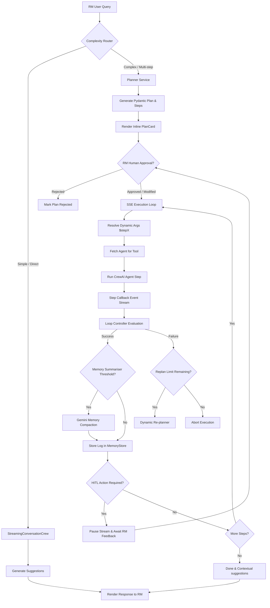

# 🏦 LoanProspect AI CRM — Architectural Overview

This document provides a high-level architectural overview of the **Unified Agentic Chat Workspace** in LoanProspect AI CRM. It details how the standalone `/planner` Autopilot console and standard `/chat` workspace have been completely consolidated into a cohesive, inline execution flow.

---

## 🧭 System Conception & Flow

At a high level, the system enables Relationship Managers (RMs) to identify high-probability personal loan prospects, aggregate transaction-level evidence, and execute highly tailored WhatsApp outreaches in a compliance-regulated banking environment.

The system utilizes a **Plan-then-Execute (ReAct / CoT)** cycle, fully embedded within the conversation workspace. When an RM sends a message:
1. **Routing & Classification**: The backend evaluates the user's intent. Simple conversational questions bypass planning, while complex banking actions trigger the Planner.
2. **Step-by-step Formulation**: The Planner translates the request into an actionable sequence of deterministic banking tools.
3. **HITL Gatekeeping**: The plan is presented to the user inline for approval or modification.
4. **Autonomous Event-Loop Execution**: Upon approval, specialized CrewAI agents execute each step sequentially.
5. **Active Memory Compaction & Loops**: Transient execution states are tracked, compacted via LLM summarization, and regulated by safety controllers.

---

## 🧩 Architectural Components

The repository is structured modularly to decouple presentation, coordination, intelligence, and data retrieval layers.

| Component | Responsibility | Core Files |
| :--- | :--- | :--- |
| **Frontend UI** | User interaction, unified streaming rendering, inline widgets. | `ConversationWorkspace.jsx`, `PlanCard.jsx`, `InlineDataGrid.jsx` |
| **API Routers** | Exposes REST and Server-Sent Events (SSE) streaming connections. | `app/api/chat.py` |
| **Planner Service** | Parses query complexity and schedules sequential step execution. | `app/services/planner_service.py` |
| **Executor Service** | Sequentially executes plan steps via dedicated CrewAI agents. | `app/services/executor_service.py` |
| **Memory Store** | Accumulates execution logs, dynamic outputs, and variables. | `app/services/memory_store.py` |
| **Summariser** | Compresses long execution histories using Gemini LLM. | `app/services/summariser.py` |
| **Loop Controller** | Decides execution control flow, handles safety thresholds, retries, and errors. | `app/services/loop_controller.py` |
| **Specialized Agents** | CrewAI Agents equipped with deterministic tools for execution. | `app/agents/agent_definitions.py` |
| **Seed / DB Layer** | SQLite schema holding customer accounts, KYC status, and campaigns. | `app/db/models.py`, `app/seed/run_seed.py` |

---

## 🔄 Unified Conversation Lifecycle

The consolidated workspace unifies direct conversation streaming with sequential plan orchestration into a single SSE connection lifecycle:

### Phase 1: Complexity Classification & Routing
All user text inputs flow through `POST /api/chat/stream`. 
- **Direct Queries** (e.g., *"Who is the current RM?"* or *"Summarize CUST001's KYC"*) are routed to the conversational agent and return immediately as plain Markdown text chunks.
- **Strategic Queries** (e.g., *"Find customers with renovation spends, validate their compliance, and draft bulk outreaches"*) are intercepted by the **Planner Service**. It yields a structured plan JSON block with `requires_approval=True` and pauses.

### Phase 2: Human-in-the-Loop Interaction
The UI intercepts the plan event and displays it as a gorgeous vertical timeline stepper using the `PlanCard` component. The RM can review the scheduled operations:
- The RM can edit step descriptions, tools, or arguments directly.
- Upon clicking **Approve Plan & Launch Autopilot**, a `POST /api/chat/sessions/{session_id}/approve-plan` is issued, syncing any edits.

### Phase 3: Autopilot Step Execution
The client opens a new, dedicated EventSource stream connection to `GET /api/chat/stream/{plan_id}`:
- The **Executor Service** begins processing steps in order.
- Each step is run inside a isolated, single-agent **CrewAI Crew** mapped to that specific tool.
- A custom `step_callback` captures internal LLM thoughts, tool calls, and results, streaming them as event logs in real-time.
- The `LoopController` evaluates intermediate results. If a step fails, it initiates a single dynamic re-planning branch to recover before aborting.
- The `MemorySummariser` estimates token size using a sliding character-to-token compression rule. If it exceeds 4,000 tokens, it triggers Gemini to compact earlier steps into a concise summary, preserving pinned variables (like customer IDs list).
- If a step is flagged as `hitl_required=True` (e.g., sending a WhatsApp message), the executor pauses, emits `paused_hitl`, and waits until the RM submits edits or validation via `POST /api/chat/sessions/{session_id}/feedback`.
- When all steps complete, final reports are compiled and returned with contextual next-step suggestions.

---

> [!TIP]
> Keep your `GEMINI_API_KEY` configured in the Settings sidebar. Deterministic scoring algorithms run entirely offline on SQLite, but AI planning, conversational agent reasoning, and contextual suggestions utilize Gemini LLM through LiteLLM.
