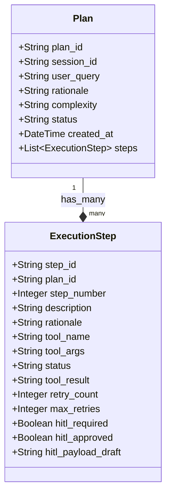

# ⚙️ LoanProspect AI CRM — Backend Architecture & Core Services

This document details the backend architecture, API endpoints, data models, and services that power the **Unified Agentic Chat Workspace** in LoanProspect AI CRM.

---

## 🏛️ Core Service Architecture

The backend is built with **FastAPI** and uses a modular layered pattern:
1. **API Controllers (`app/api/`)**: Expose REST endpoints and Server-Sent Events (SSE) streams.
2. **Business Services (`app/services/`)**: Orchestrate core workflows, memory management, planning, and execution loops.
3. **Multi-Agent Orchestrator (`app/agents/`)**: Defines CrewAI agents, tasks, and crews backed by Gemini LLMs via LiteLLM.
4. **Data Repository Layer (`app/db/repositories/` & `app/db/models.py`)**: SQLite data models and CRUD repositories using SQLAlchemy ORM.

---

## 💾 Core Execution Data Models

Plans and step execution histories are stored in SQLite and mapped through SQLAlchemy.



### Plan Table
Keeps track of overall plan metadata, status, and binds a plan to a specific conversational session.
- **`plan_id`**: UUID primary key.
- **`session_id`**: Links to `chat_sessions`.
- **`status`**: `'planning' | 'pending' | 'running' | 'completed' | 'failed'`.

### ExecutionStep Table
Maintains state, retries, and inputs/outputs for individual atomic tool calls.
- **`tool_args`**: JSON string representing resolved arguments or dynamic notation references.
- **`status`**: `'pending' | 'running' | 'success' | 'failed'`.
- **`hitl_required`**: Flag indicating if a step requires RM review before starting (e.g. outreach or credit overrides).
- **`hitl_payload_draft`**: Customized message edits written by the RM.

---

## 🔌 Unified Chat & Execution APIs

The API layer under `app/api/chat.py` unifies traditional streaming chats with sequential multi-step scheduling:

### 1. `POST /api/chat/stream`
Evaluates query complexity:
- **Direct Streaming Flow**: If the query is simple, it runs `StreamingConversationCrew` inline, yielding `application/x-ndjson` events (status, thoughts, tool calls, text chunks, done, suggestions).
- **Planning Flow**: If the query is complex, it runs `PlannerService.generate_plan` to compile a sequence of steps, saves them in the DB, and yields a single `"type": "plan"` JSON event before closing the connection.

### 2. `POST /api/chat/sessions/{session_id}/approve-plan`
Allows RMs to approve, reject, or supply customized step overrides.
- On approval, the plan's status transitions from `planning` to `running`.
- If custom steps are passed in `edited_steps`, the backend deletes the existing pending steps and writes the customized steps to SQLite.

### 3. `GET /api/chat/stream/{plan_id}`
Establishes a dedicated Server-Sent Events (SSE) stream (`text/event-stream`) which runs the consolidated executor loop.
- It iterates through the database execution steps sequentially.
- Feeds each step's output to the active `MemoryStore` container.
- Emits real-time SSE logs back to the client.

### 4. `POST /api/chat/sessions/{session_id}/feedback`
Unified channel to submit Human-in-the-Loop inputs:
- If a direct chat crew is awaiting confirmation, it forwards feedback to `session_stream_registry`.
- If a sequential plan executor is paused on a step (e.g. outreach preview), it updates the running step's `hitl_approved=True` status and releases the blocked thread inside `plan_stream_registry`.

---

## 🧠 Memory Store & Dynamic parameter Resolution (`memory_store.py`)

A structured transient container (`MemoryStore`) tracks progress *within* a single plan execution.

### Dynamic Parameter Resolution
Often, a future step depends on the output of a previous step (e.g., Step 1 ranks prospects, Step 2 fetches transaction signals, and Step 3 drafts outreach). The Planner generates arguments using a dynamic notation pattern:
- `"$step1.output.customer_ids"`
- `"$step2.output"`

When resolving arguments, `MemoryStore.resolve_dynamic_notation()` parses the notation, looks up the referenced step in its logs, extracts the required keys, and replaces the variable with real objects (e.g. a Python `list` of customer IDs or a single customer CSV string).

### Pinned Facts
During execution, critical domain identifiers (like lists of customer IDs or compliance warnings) are extracted and stored in `pinned_facts`. These facts are marked as **immutable** and are never compressed away.

---

## 🗜️ Memory Compaction & Summarisation (`summariser.py`)

To prevent LLM context-window overload and keep token consumption low, the `MemorySummariser` evaluates memory size periodically.

- **Threshold**: Compaction is triggered if `MemoryStore.get_token_count()` exceeds **4,000 tokens** (estimated at ~4 characters per token).
- **Sliding Window**: It splits execution logs, keeping the **recent 2 steps** raw and readable in the active window.
- **LLM Compression Prompt**: Earlier technical step logs are packaged and sent to Gemini to generate a high-density, cohesive chronological business summary.
- **Outcome**: The raw historical logs are replaced by the high-density narrative summary, reducing token load by up to **80%** while preserving pinned facts.

---

## 🚦 Safety Loops & Control Flow (`loop_controller.py`)

The `LoopController` serves as the runtime governor for plan execution, enforcing safety boundaries and handling errors.

| Deciding Factor | Logic / Condition | Loop Action | Reason |
| :--- | :--- | :--- | :--- |
| **Max Steps Cap** | Total executed steps $\ge 10$. | `abort` | Safety boundary to prevent infinite billing or agent runaways. |
| **Step Hard Failure** | Tool exception / error. | `replan` | Calls the dynamic re-planner. Limit: **1 replan** per plan. |
| **Exhausted Replans** | Step fails when `replan_count` is already at limit. | `abort` | Aborts execution to prevent infinite retry loop. |
| **Empty Observation** | Tool output is empty, `null`, `[]`, or `"{}"`. | `continue` | Proceeds with caution. If consecutive empty runs $\ge 3$, it **aborts** execution. |
| **Normal Path** | Successful output. | `continue` | Proceeds to execute the next pending step. |

---

## 🔧 Agent & Tool Resolution Loop

The `ExecutorService` executes steps using isolated, single-agent CrewAI crews:

```python
agent = get_agent_for_tool(step.tool_name)
```

The system dynamically maps each tool to its most qualified specialized agent (e.g. mapping `detect_life_event_spends` to the `EvidenceAggregationAgent`).

To capture sub-step execution details, a custom `step_callback` is injected into the agent:
```python
def step_callback(agent_output):
    if hasattr(agent_output, "thought"):
        event_queue.put(json.dumps({"type": "thought", "text": agent_output.thought, "step_number": step_number}))
    if hasattr(agent_output, "tool"):
        event_queue.put(json.dumps({"type": "tool_call", "tool": agent_output.tool, "input": agent_output.tool_input, "step_number": step_number}))
```
This callback streams LLM thoughts, tool invocations, and observations in real-time to the event queue, providing a highly visual, transparent "black box" explanation of the agent's work.
